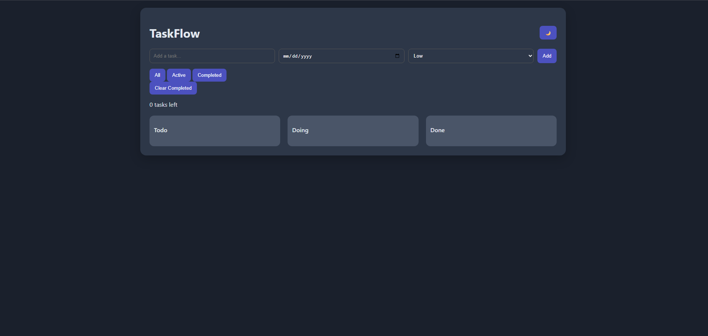
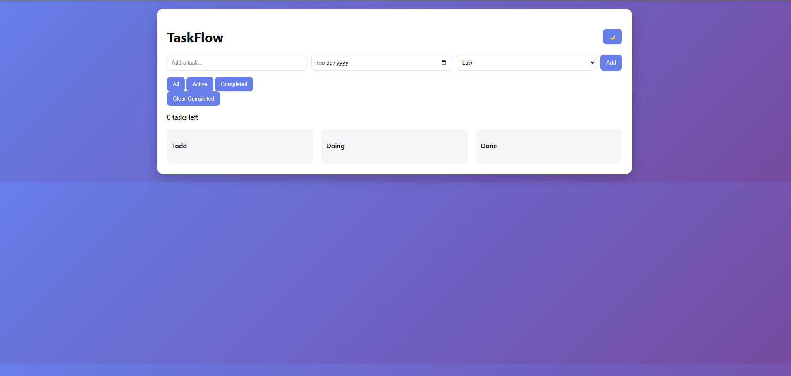

TaskFlow – Kanban Task Manager

A modern Kanban-style task management app built with vanilla JavaScript.

🚀 Features
Add, edit, delete tasks
Drag & drop between columns
Reorder tasks inside columns
Priority system (low / medium / high)
Due dates with overdue highlight
Filter tasks (all / active / completed)
Dark mode 🌙
Mobile responsive 📱
LocalStorage persistence
🛠 Tech Stack
HTML
CSS (Flexbox, responsive design)
JavaScript (DOM, events, localStorage)
🎯 What I learned
Managing UI state
Drag & drop logic
Responsive design
Clean UI/UX principles
📸 Screenshot

()
()

🔗 Live Demo

(Add your deployed link here)